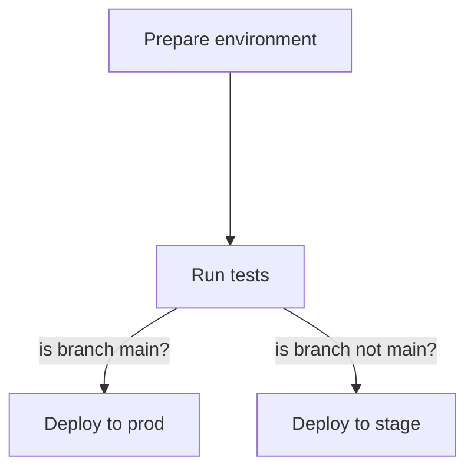

# helmwave-demo

[](https://github.com/Jasstkn/helmwave-demo/actions/workflows/deploy.yml)

This is demo repository for testing helmwave features with enabled CI/CD and multi-environments feature.



## commands

Generate `helmwave.yml` from template.

```bash
helmwave yml
```

Generate manifests

```bash
helmwave build
```

Deploy by one command

```bash
helmwave up --yml --build --kubedog
```

Destroy all

```bash
helmwave down
```
